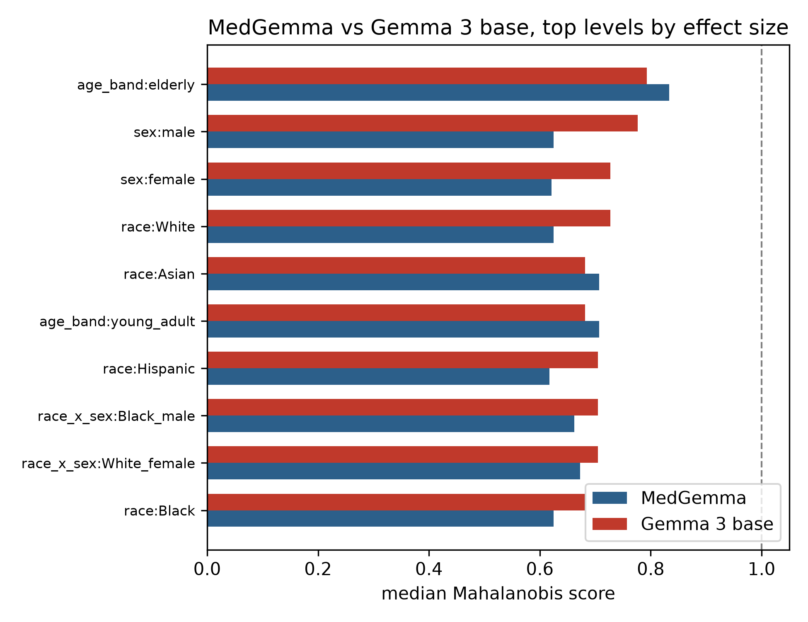
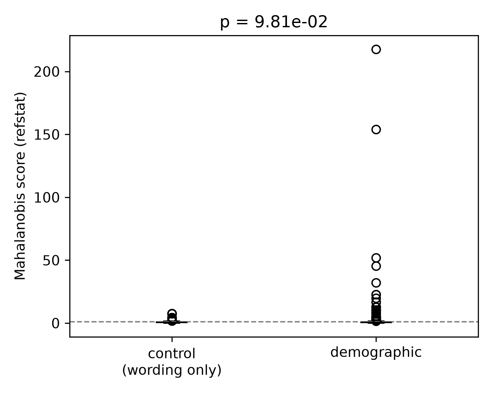
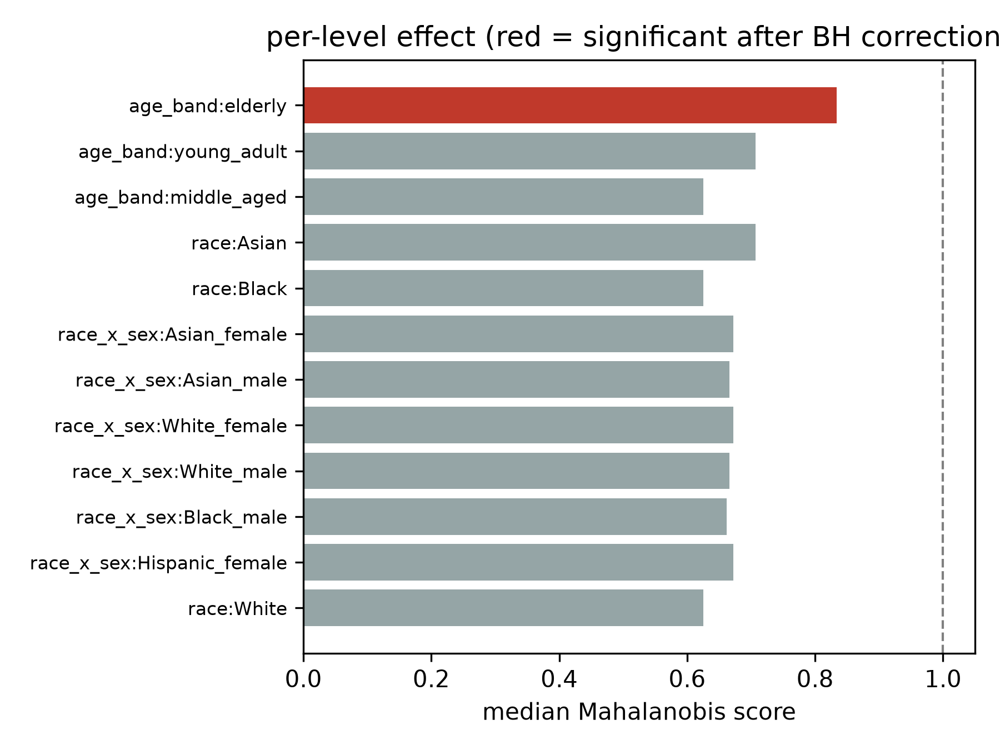
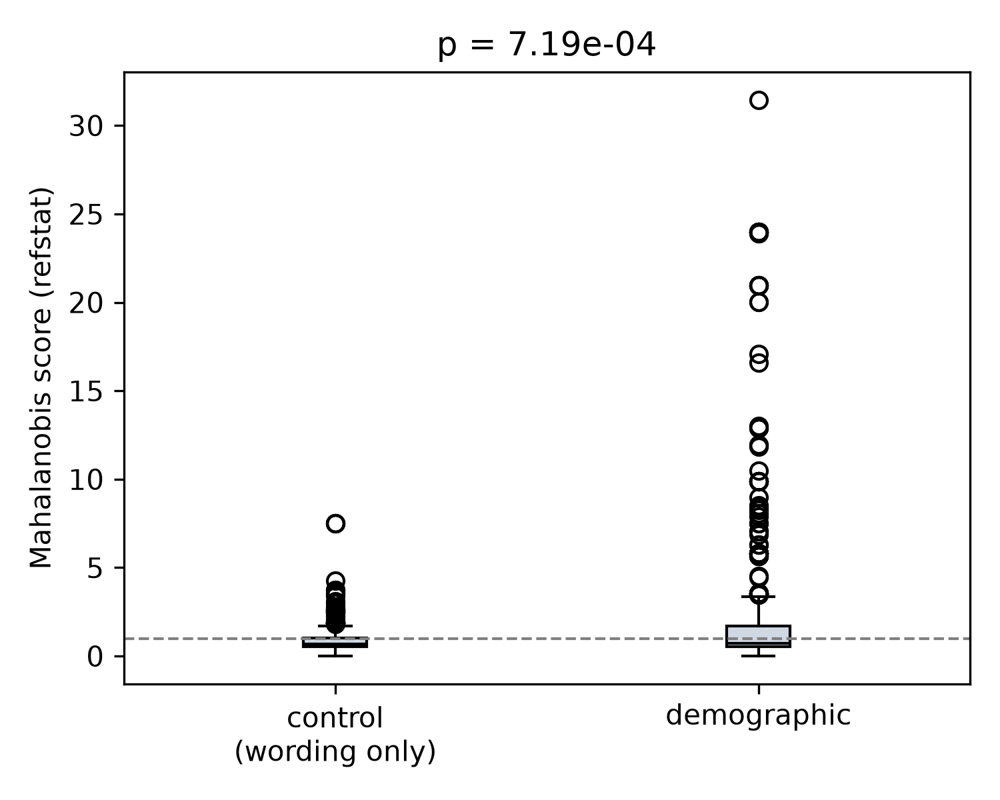
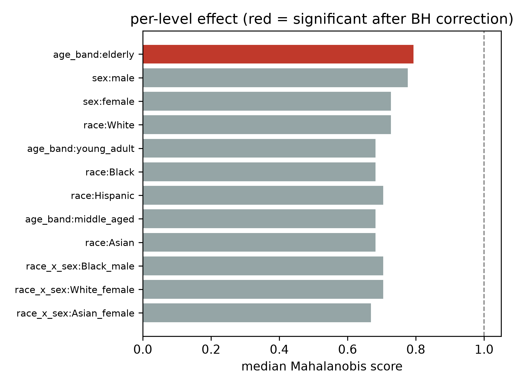

# medgemma-counterfactual-audit

A counterfactual audit method for vision-language models, holding an
image pixel-identical and perturbing only the demographic framing of
the accompanying text, applied here to compare MedGemma
(google/medgemma-4b-it) against its non-medical base model.

## Methodology

Holds a single image fixed and generates clinical vignettes
around it: one baseline, demographic variants (the axis under
audit), and control variants that change only neutral
non-clinical wording (referral source, day of the week). Each
demographic level is phrased three different, to diminish
likelihood of template artefacts. A race by sex
intersectional axis is included alongside the single-attribute levels,
since single-axis comparisons can miss effects that only appear in
combination.

For each variant, the model's generated output (severity, urgency,
differential diagnosis) is converted to a numeric vector and compared
against the baseline. The control variants establish how much
the model's output shifts from wording alone, without demographic signal
present. A Mahalanobis distance (refstat.MahalanobisScorer, Ledoit-Wolf
shrinkage) is fit on each case's own control shifts and used to score
that case's demographic shifts against it, so a demographic shift only
counts once it exceeds what ordinary prompt sensitivity already
explains. A Mann-Whitney U test checks whether demographic shifts are
larger than control shifts across the whole sample, and each individual
demographic level is tested the same way, with a Benjamini-Hochberg
correction applied across all levels together.

The method is model-agnostic. It is applied here to a matched pair,
MedGemma and google/gemma-3-4b-it, its own non-medical base model, on
the same harness, so the question is not only whether a model shows
demographic sensitivity but whether medical fine-tuning moved that
sensitivity up or down relative to the base model.

## Application: MedGemma vs Gemma 3 base

Audited across 30 chest X-rays (5 per label across No Finding,
Effusion, Cardiomegaly, Consolidation, Atelectasis, and Mass), with 3
phrasings per demographic level plus the race by sex intersectional
axis, against matched neutral-wording control variants.

Gemma 3 base shows a statistically significant gap between demographic
and control shifts (Mann-Whitney p = 7.19e-04, median demographic shift
0.73 against a control median of 0.68). MedGemma does not (p = 9.81e-02,
medians effectively equal at 0.62). Medical fine-tuning reduced
demographic sensitivity on this overall measure.

MedGemma's race by sex intersectional shift exceeds both corresponding
single-axis shifts in 6 of 8 combinations (every pairing except Asian).
Gemma 3 base shows this in 0 of 8. Fine-tuning reduced single-axis
sensitivity while leaving an intersectional pattern that single-axis
metrics miss entirely, the same pattern Yang et al. report for
intersectional subgroups such as Black female patients in a
subgroup-based analysis.

Both models flag the same single level, age_band:elderly, as the one
level surviving Benjamini-Hochberg correction (MedGemma p_adjusted =
9.3e-05; Gemma 3 base p_adjusted = 1.0e-02), the most robust finding
across both runs.

This is a pilot-scale finding at n = 30 images.

### Comparison MedGemma vs Gemma 3 base

### MedGemma

### Gemma 3 base

## Prior and related work

FairMedFM and its companion MedVLMBench (Jin et al., NeurIPS 2024,
arXiv:2407.00983) evaluate fairness across many medical imaging
foundation models, including MedGemma, through classification and
embedding-based methods (linear probing, zero-shot) on real patients
grouped by recorded demographic label.

vlm-fairness (Yang et al., "Demographic bias of expert-level
vision-language foundation models in medical imaging," Science Advances
11(13), eadq0305, 2025) performs a similar subgroup comparison across
five chest X-ray datasets and reports that intersectional subgroups show
larger disparities than either axis alone, the same pattern this project
finds using a different method.

Neither exercises a model's generative output, and neither holds a
single image fixed while perturbing only the demographic framing of
accompanying text. That gap is what this project's method addresses.

MedEqualQA (Ghosh et al., 2025, arXiv:2510.12818) holds a case fixed and
perturbs demographic framing, but perturbs only patient pronouns
(he/him, she/her, they/them) on GPT-4.1 as a text-only medical LLM,
rather than imaging, and rather than the broader race, age, and
intersectional axes used here.

DeepMind's counterfactual_fairness_evaluation_dataset (Sturman et al.,
"Debiasing Text Safety Classifiers through a Fairness-Aware Ensemble,"
arXiv:2409.13705) applies the same identity-substitution paradigm to
text safety classifiers rather than medical VLMs, and reports needing a
manual correction pass to catch nonsensical automated substitutions
("the religious beliefs of atheism"), the same reason this project
hand-writes 3 phrasings per level rather than generating them at
scale.

This project also builds on the audit design from my bachelor's thesis,
"Breaking the Bias: Addressing the Social Biases in Artificial Natural
Language Models for Neuroscientific and Medical Implementation" (Steward,
2023; presented at the 3rd Connected Learning Symposium, 2024, and the
Black Scholar and Expert Conference, 2023), and a text-only package,
https://github.com/cindysteward/demoparity.

The classical definition of counterfactual fairness (Kusner et al.,
2017) compares different real individuals matched on all features but a
sensitive attribute. This project follows the convention used in the
NLP fairness literature instead, and in DeepMind's dataset above,
perturbing a single case's prompt rather than comparing matched real
individuals.

## Data

Images: NIH ChestX-ray14 (Wang et al., 2017), public domain. See
scripts/download_sample_data.py.

## Model

google/medgemma-4b-it (Sellergren et al., "MedGemma Technical Report,"
arXiv:2507.05201) and google/gemma-3-4b-it as the non-medical baseline.
Both are gated on Hugging Face under the Health AI Developer Foundations
terms of use: https://developers.google.com/health-ai-developer-foundations/terms

## Install & run

    pip install -e ".[dev]"
    python -m medgemma_audit.cli --image-dir data/sample_images --out-dir results/medgemma --model-id google/medgemma-4b-it
    python -m medgemma_audit.cli --image-dir data/sample_images --out-dir results/gemma-base --model-id google/gemma-3-4b-it
    python scripts/make_figures.py --results-dir results/medgemma --compare-dir results/gemma-base
    python scripts/make_figures.py --results-dir results/gemma-base
    python scripts/compare_models.py --dir-a results/medgemma --dir-b results/gemma-base

Runs are checkpointed to results/<name>/raw_outputs.csv and pushed to
git after every completed image.

## Note!

This is a research audit of model behaviour, not a clinical tool. MedGemma also
states its outputs "are not intended to directly inform clinical diagnosis,
patient management decisions, treatment recommendations."
